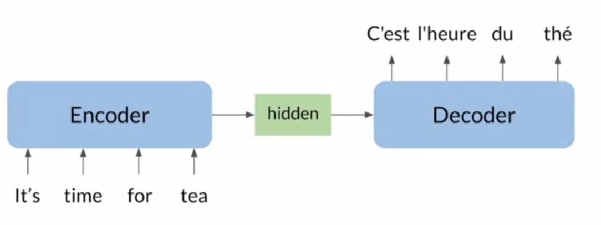

# Natural Language Processing with Attention Models

# Week 1: Neural Machine Translation

## Outline

- Introduction to Neural Machine Translation
- Seq2Seq model and its shortcomings
- Solution for the information bottleneck

## Neural Machine Translation

In NMT we used an encoder and a decoder. For example to translate from English to French.

## Seq2Seq model

- Introduced by Google in 2014
- Maps variable-length sequences to fixed-length memory
- Inputs and outputs can have different lengths
- LSTMs and GRUs to avoid vanishing and exploding gradient problems

The encoder and decoder architectures are illustrated below

One of the problems with this architecture is the Information bottleneck. Because only a fixed amount of information goes from the encoder to the decoder.

The power of Se2Seq of variables length and fixed length memory become a bottleneck for large sentences. In other words, as sequence size increases, model performance decreases.

- One idea is to use all encoder hidden states.

The idea of using all hidden states can be achieve by using a better hidden layers between the encoder and decoder. This solution is ATTENTION. The model can focus on specific hidden states at every step.

## Attention

One of the original papers about Attention was introduce on **Neural Machine Translation by Jointly Learning to Align and Translate** *by Dzmitry bahdanau, KyungHyun Cho and yoshua bengio***.**

Paper → [https://arxiv.org/abs/1409.0473](https://arxiv.org/abs/1409.0473)

The below graph shows a huge difference between Traditional Seq2Seq and Seq2Seq with Attention

## How to use all the hidden states?

In order to use all hidden states from the encoder in an efficient way, we can set weights depending on the previous hidden state in the decoder. This is the core idea behind attention

## The attention layer in more depth

In order to find similar key for the given query, we use scaled dot-product attention

1. MatMul: Get Similarity Between Q an K 
2. Scale: Scale using the root of the key vector size
3. SoftMax: Weights for the weighted sum
4. MatMul: Weighted sum of values V

In the core, attention is the multiplication of two matrixes and a Softmax.

## Machine translation setup

- Use pre-trained vector embeddings
- Otherwise, initially represent words with one-hot vectors
- Keep track of index mappings with word2ind and ind2word dictionaries
- Add end of sequence tokens: <EOS>
- Pad the token vectors with zeros

### Teacher Forcing

One problem with sequential predictions is that one error may be propagated on further steps, at the end of the prediction the meaning may be extremely different. To avoid this problem, we can use teacher forcing which means we can pass the right label in each state even if the model predicted wrong some cell. This helps to model learned better.

## NMT Model with Attention

In more details we have the following architecture for NMT

### BLEU Score

BLUE stands for **B**i**L**ingual **E**valuation **U**nderstudy. It evaluates the quality of machine translate by compares candidate translations to reference (human)  translations. The closer to 1 the better

BLUE Score also have some problems

- BLUE doesn’t consider semantic meaning
- BLUE doesn’t consider sentence structure: “Ate I was hungry because”

### ROUGE Score

**R**ecall-**O**riented **U**nderstudy for **G**isting **E**valuation

Compares candidates with reference (human) translations

### ROUGE-N, BLUE and F1 score

# Week 2: Text Summarization

One of the biggest problems with traditional Seq2Seq Architectures is that each step need the previous step. Hence, We have T sequential steps. In addition, there a loss of information and vanishing gradient problem.

[https://www.notion.so](https://www.notion.so)

We saw before that Attention help with the problems of loss information and vanishing gradient. 

However, we want to improve the parallels on the architecture. Hence we introduce Transformers because  **Attention is all you need**

## Scaled Dot-Product Attention

Transformer use Scaled Dot-Product Attention

In general we use multi-head attention which can run in parallel =)

The transformer Encoder

The decoder

## RNNs vs Transformer: Positional Encoding

Notice how the Transformer add values into the embedding to priority relevant word respect to current one.

## Transformer Applications

- Text Summarization
- Auto-Complete
- named Entity Recognition (NER)
- Question answering (Q&A)
- Translation
- Chat-bots
- Other NLP Tasks
    - Sentiment Analysis
    - Market Intelligence
    - Text Classification
    - Character Recognition
    - Spell Checking

## T5: Text-to-Text Transfer Transformer

With transformer we can train a single model and use that model for more specialize cases like Translation, Classification, Q&A.

[https://t5-trivia.glitch.me/](https://t5-trivia.glitch.me/)

## Understanding Attention

- Queries: From one sentence
- Keys and Values from another

Looking at Query and the key we have

Looking at the math behind attention

## Masked Self-Attention

In self-attention the queries, keys and values came from the same sentence. Hence, you get the attention within the sentence. 

In Masked Self-Attention, queries, keys and values come from the same sentence. Queries do not attention to future positions. 

Mathematically we mask the attention by adding a mask matrix inside the SoftMax.

## Multi-head Attention

With a little more details. Multi-Head Attention works as follows

## Transformer Decoder

### Explanation with a sentence

## Final Example a summarization

Lets preprocess the data

Then we check the Cross entropy Loss

Now we can train our transformer summarizer

The inference will look like

# Week 3: Question Answering & Hugging Face

- Context-Based Q&A
- Closed Book Q&A

## General Purpose Learning

Use a model pre- trained and use it to performance a task you want. Assume you used a pretrain model CBOW

There are three main advantages to transfer learning:

- Reduce training time
- Improve predictions
- Allows you to use smaller datasets

## Examples of different architecture

## Hugging Face 🤗

[https://huggingface.co/models](https://huggingface.co/models)

# References

## [Exploring the Limits of Transfer Learning with a Unified Text-to-Text Transformer](https://arxiv.org/abs/1910.10683) (Raffel et al, 2019)

### [Reformer: The Efficient Transformer](https://arxiv.org/abs/2001.04451) (Kitaev et al, 2020)

### [Attention Is All You Need](https://arxiv.org/abs/1706.03762) (Vaswani et al, 2017)

### [Deep contextualized word representations](https://arxiv.org/pdf/1802.05365.pdf) (Peters et al, 2018)

### [The Illustrated Transformer](http://jalammar.github.io/illustrated-transformer/) (Alammar, 2018)

### [The Illustrated GPT-2 (Visualizing Transformer Language Models)](http://jalammar.github.io/illustrated-gpt2/) (Alammar, 2019)

### [BERT: Pre-training of Deep Bidirectional Transformers for Language Understanding](https://arxiv.org/abs/1810.04805) (Devlin et al, 2018)

### [How GPT3 Works - Visualizations and Animations](http://jalammar.github.io/how-gpt3-works-visualizations-animations/) (Alammar, 2020)