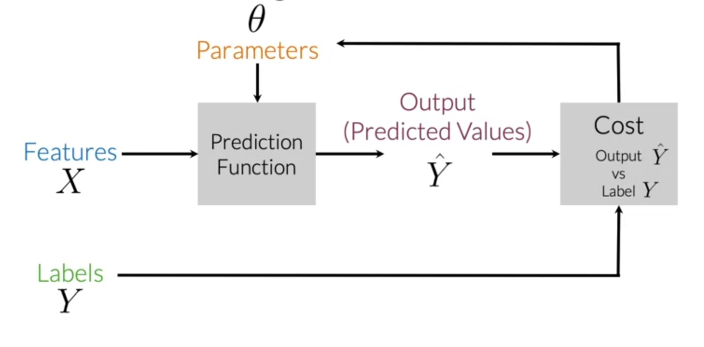

# Natural Language Processing with Classification and Vector Spaces

# Week 1: Logistic Regression

## Supervised Learning & Logistic Regression

In supervised machine learning, you usually have an input X, which foes into y our prediction function to get your Ŷ**.** You can compare your prediction with the true value of Y. This gives you your cost which you use to update the parameters of theta.

For example: We can use supervised learning for sentiment analysis to analyze a sense and classify it as positive or negative. 

For logistic regression our Prediction Function is the sigmoid function.

Logistic regression makes use of the sigmoid function which outputs a probability between 0 and 1. The sigmoid function with some weight parameter *θ* and some input *x*(*i*) is defined as follows.

Illustration of Gradient Decent

After so many iteration the cost should converges into an minimal cost.

After finding the optimal Cost and we finish improving our model. To compute accuracy, you solve the following equation:

## Sparse representations:

Representations with a lot of zeros. In order words it is 0 almost everywhere. 

One of the main problems with sparse representations are

1. Large training time
2. Large prediction time

## Simple representations of tweets:

tweet = [1, sum(positive words), sum(negative words)]

## Preprocessing

### Elimination of words

**Stop words**: select a list of words consider stop words that will be eliminate  from the sentence.

We can do the Same with Handlers aka tags and  URLS since they usually don’t provide any value into the sentence. 

Similarly we can eliminate punctuation. However, sometime punctuation add value into a sente like exclamation marks !

### Stemming and lowercasing

We can to change the words into their basic form. For instance, tuning can be turn into tun. Similar with all variations of tune like tune, tuned, tunning.

lowercase is self explanatory and all it does is lower case the sentence.

# Week 2: Naive Bayes

Last week we classify tweets using linear regression. The objective of this we will be doing sentiment analysis using Naive Bayes.

To build a classifier, we will first start by creating conditional probabilities given the following table:

This allows us compute the following table of probabilities:

Once you have the probabilities, you can compute the likelihood score as follows

We clearly see a problem in the case a word is 0. In other words, if we have a word that is present in one class but not in the other this will add extreme noise into the probability. Hence, we need to apply a smooth operator into the probability. In this case we will be applying the Laplacian Smoothing function.

There is a big problem of using the probabilities directly. Overflow, when multiplying numbers the  resulting number may be very big resulting on computer overflow. For this reason, we use the log function on the the ratios to smooth and lower our numbers.

## Training Naive Bayes

- Collect and annotate corpus
- Preprocess
- Word Count
- Compute P(w | class) using Laplace smoother
- Get Lambda score of each word aka log of previous values
- Get the log prior which is the log number of positive tweets over log of number of negative tweets

### Testing naive Bayes

For testing we compute the score of a tweet and then make a prediction on it

# Week 3: Vector Space Models

Vector spaces are very useful on NLP and representation theory. It help us understand the meaning of sentences and to differentiate when two sentences have similar meaning or different meanings. 

## Word by Word Design

One way to represent the meaning of the sentences as vector is by creating matrix where each row and column corresponds to a word in your vocabulary. Then you can iterate over a document and see the number of times each word shows up next each other word. We can think of *K* as the bandwidth that decides whether two words are next to each other or not. 

The data matrix above is called a co-concurrent matrix.

## Word by Document Design

Applying the  same concept as word by word design we can map words to documents. 

The rows could correspond to words and the columns to documents. The numbers in the matrix correspond to the number of times each word showed up in the document.

You can represent the entertainment category, as a vector *v*=[500,7000]. You can then also compare categories as follows by doing a simple plot.

## PCA

**Steps to Compute PCA:**

- Mean normalize your data
- Compute the covariance matrix
- Compute SVD on your covariance matrix. This returns [U S V] =*svd*(Σ). The three matrices U, S, V are drawn above. U is labelled with eigenvectors, and S is labelled with eigenvalues.
- You can then use the first n columns of vector *U*, to get your new data by multiplying *XU*[:,0:*n*].

# Week 4: Machine Translation

## Learning Objectives

Develop tools to perform Machine Translation and Document Search. Specifically we will cover

- Transform vector
- K nearest neighbors
- Hash tables
- Divide vector space into regions
- Locality sensitive hashing
- Approximated nearest neighbors

learn a mapping that will allow you to translate words by learning a "transformation matrix". Here is a visualization:

Here is a visualization of that showing you the aligned vectors:

After you have computed the output of *XR* you get a vector. You then need to find the most similar vectors to your output. Here is a visual example:

## Locality Sensitive Hashing

Locality sensitive hashing is a technique that allows you to hash similar inputs into the same buckets with high probability.

## Approximate Nearest Neighbors

Approximate nearest neighbors does not give you the full nearest neighbors but gives you an approximation of the nearest neighbors. It usually trades off accuracy for efficiency. Look at the following plot:

## Searching Documents

A toy example of how you can actually represent a document as a vector.

