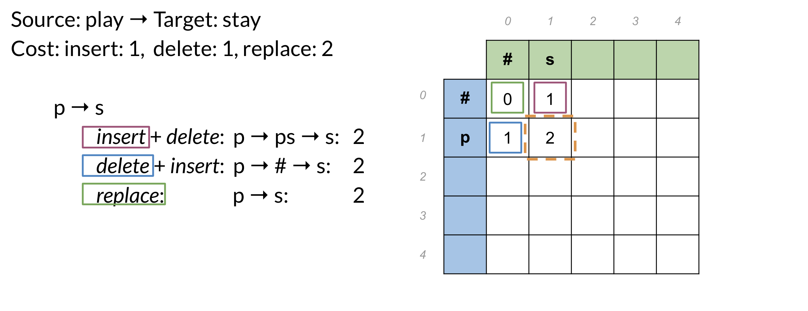

# Natural Language Processing with Probabilistic Models

# Week 1: Autocorrect and Minimum Edit Distance

## Learning Objectives:

- What is autocorrect?
- Building the model
- Minimum edit distance
- Minimum edit distance algorithm

### What is autocorrect?

It is an algorithm that provide suggestion to a misspelled words considering the context where the misspelled word is located

### How it works?

We would like to build a model to identify and provide suggestion. We will have 4 key steps to build this model.

1. Identify a misspelled word
    1. Are they in my dictionary?
2. Find strings n-edit distance away
    1. Insert a letter
    2. Delete a letter
    3. Swap two adjacent letters
    4. Replace a letter
3. Filter candidates
    1. If the candidate word is not in the dictionary ⇒ delete it
4. Calculate word probabilities
    1. Calculate word frequency.
    2. P(w) = C(w)/ V which is the frequency over the size of the vocabulary 

### Minimum Edit Distance

- How to evaluate similarity between 2 strings?
    - Minimum number of edits needed to transform 1 string into the other

We can use Dynamic Programming to solve the problem of finding the minimum distance problem.

 

To populate the following table:

There are three equations:

- **D[i,j] = D[i-1, j] + del_cost:** this indicates you want to populate the current cell (i,j) by using the cost in the cell found directly above.
- **D[i,j] = D[i, j-1] + ins_cost:** this indicates you want to populate the current cell (i,j) by using the cost in the cell found directly to its left.
- **D[i,j] = D[i-1, j-1] + rep_cost:** the rep cost can be 2 or 0 depending if you are going to actually replace it or not.

At every time step you check the three possible paths where you can come from and you select the least expensive one. Once you are done, you get the following:

# Week 2: Part of Speech Tagging

## Outline

- What is part of Speech tagging?
- Markov chains
- Hidden Markov models
- Viterbi algorithm
- Examples

### What is part of speech?

- Adverb
- Verb
- Noun
- determiner

We want to assign TAG to our sentences.

## Markov Chains

You can use Markov chains to identify the probability of the next word. To properly model the probabilities we need to identify the probabilities of the POS tags and for the words.

The circles of the graph represent the states of your model. A **state** refers to a certain condition of the present moment.  You can think of these as the POS tags of the current word.

*Q*={*q*1,*q*2,*q*3} is the set of all states in your model.

## Markov Chains and POS Tags

To help identify the parts of speech for every word, you need to build a transition matrix that gives you the probabilities from one state to another.

In the diagram above, the blue circles correspond to the part of speech tags, and the arrows correspond to the transition probabilities from one part of speech to another. You can populate the table on the right from the diagram on the left. The first row in your **A** matrix corresponds to the initial distribution among all the states. According to the table, the sentence has a 40% chance to start as a noun, 10% chance to start with a verb, and a 50% chance to start with another part of speech tag.

The **transition** **probabilities** allowed you to identify the transition probability from one POS to another. We will now explore hidden markov models. In hidden markov models you make use of **emission** **probabilities** that give you the probability to go from one state (POS tag) to a specific word.

In order to compute the Transition matrix we need to count each pair of possibilities in out corpus as illustrative below

*C*(*t*(*i*−1),*t*(*i*)) is the count of times *tag (i-1)* shows up before *tag i*. From this you can compute the probability that a tag shows up after another tag.

One important thing to consider is that some corpus may lack enough information on some pairs which will overfit the transition matrix to generalize to other problems. Hence, we want to apply smoothing into the transition matrix by adding an small epsilon

Now that we now how to compute the transition matrix we do a similar formula to compute the emission matrix.

## Viterbi algorithm

### Initialization

### Forward Pass

This will be best illustrated with an example:

### Backward Pass

The equation above just gives you the index of the highest row in the last column of C. Once you have that, you can go ahead and start using your D matrix as follows:

# Week 3: Autocomplete

The objective of this week is to process text corpus to N-gram language model

## N-gram

An n-gram is a sequence of N words. Example: Corpus ⇒  **I am happy because I am learning**

- Unigram: {I, am, happy, because, learning}
    - P(I) = 2 / 7
- Bigram: {I am, am happy, happy because, because I, am leaning}
    - P(am | I) = C(I am) / C(I) = 2 / 2 = 1
    - P(happy| I) = C(I happy) / C(I) = 0 / 2 = 0
    - P(learning | am) = C(am learning) / C(am) = 1 / 2
- Trigram: {I am happy, am happy because, happy because I, because I am, I am leaning}
    - P(happy | I am ) = C( I am happy) / C(I am) = 1 / 2
    
    ## Probability of a sequence
    
    For example compute the probability of P(the teacher drinks tea) = ?
    
    P(the teacher drinks tea) = P(the) P(teacher | tea) P(drinks | the teacher) P(tea | the teacher drinks)
    
    One problem with this approach is that some probability may not appear. Hence we may have zeros. Another techniques we can apply to avoid this problem is approximating probabilities by using Bigrams.
    
    
    

## Out of vocabulary words

There are two may paradigms for it

- Closed vs Open vocabularies

Unknown words = Out of vocabulary word (OOV). We can model unknown word with the tag <UNK>

### Using <UNK> in corpus

- Create vocabulary V
- Replace any word in corpus and not in V by <UNK>
- Count the probabilities with <UNK> as with any other word

### How to create a vocabulary V

- Criteria:
    - Min word frequency f
    - Max |V|, include words by frequency
- Use <UNK> sparingly
- Perplexity - Only compare LMs with the same V

### Smoothing

# Week 3: Word Embeddings

## Outline

- Identify the key concepts of word representations
- Generate word embeddings
- Prepare text for machine learning
- Implement the continuous bag-of-words model

## Simple Approaches for Embeddings

When we consider two basic approach like assign integers to words or one-encoded. We notice big problem with each of this approach.

1. If we assign integers, there is no reason why a word may have a bigger number than another one. So we encounter the weight of the number playing a role and we can’t encapsulate very well the relation of words with this approach
2. one-hot encoding seems like a good approach which is simple. However, when the vocabulary is huge this will include a considerable number of features. Even more, the distance between two words will be constant. Hence, encapsulating the relation between words is hard.

## Word Embedding vectors

The main idea is to assign a word into a vector on a fix-dimensional space.

- Low dimension compare with one-hot vectors
- Embed meaning
    - Semantic distance
        - forest is similar to tree
        - forest is not similar to ticket
    - Analogies
        - Paris is a France as Rome is a ….

One very efficient way to create a word embedding is creating a Machine learning model that transform the word into a vector of numbers in a given dimension. 

## Basic Word Embeddings Methods

- word2vec ( Google, 2013)
    - Use shallow NN to learn word embedding
    - Continuous bag-of-words (CBOW)
    - Continuous skip-gram/Skip-gram with negative sampling (SGNS)
- Global Vectors (GloVe) (Stanford, 2014)
    - Factorize the logarithm of the corpus’s word co-occurence matrix, similar to a count matrix.
    - This architecture does NOT use a neural network
- fastText (Facebook, 2016)
    - Based on the skip-gram model and takes into account the structure of words by representing words as an n-gram.
    - Supports out-of-vocabulary (OOV) words

## Advance Word Embedding Methods

Deep learning, contextual embeddings

- BERT (Google, 2018)
- ELMo ( Allen Institute for AI, 2018)
- GPT-2 (OpenAI, 2018)

## Continuous Bag of Words Model

In a nutshell we want to pass a window through the corpus and predict the center word of that window. 

Visually

For example if we take a simple Corpus as the sentence “I am happy because I am learning” the algorithm would look like

## Transforming words into vector

This is an important step that use one-hot vector to represent the word as a vector so we can train the model that we will actually give us the embedding

Now that we have everything we can talk about the actual model.

## CBOW Model

### Architecture

### Relu and Softmax functions

RELU

Softmax

## CBOW Cost Function

As many classification problems, CBOW use cross-entropy as the loss function

A simple example is the following:

## CBOW Training

While training a process we need to do the following

- Forward propagation
- Cost
- Backpropagation and gradient descent

### CBOW Forward Propagation

Apply the input matrix into the CBOW architecture to obtain a predicted center word matrix. 

Forward propagation is defined as:

*Z_*1=*W_*1 * *X*+*B_*1

*H*=*ReLU*(*Z_*1)

*Z_*2=*W_*2 * *H*+*B_*2

*Y*^=*softmax*(*Z_*2)

In the image below you start from the left and you forward propagate all the way to the right.

### CBOW Cost

Compute the mean of losses for the batch of trained examples

where J(i) is the loss of the predicted example i-th.

### CBOW Backward Propagation

- Backpropagation: Calculate partial derivatives of cost with respect to weights and biases
- Gradient descent: Update weights and biases

