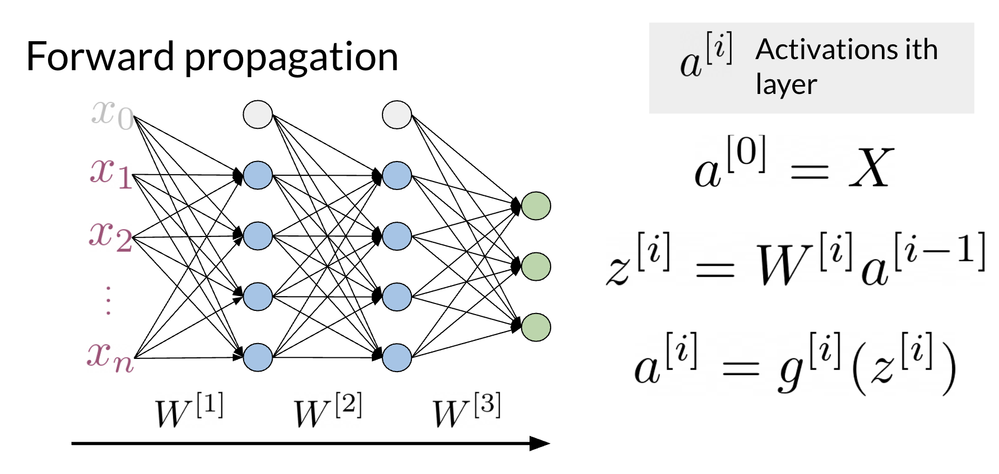

# Natural Language Processing with Sequence Models

# Week 1: Classifications using NN

This week is separative in two parts

- Sentiment Analysis of Tweets using a basic Neural Network
- Sentiment Analysis of Tweets using Complex Neural Networks
    - Compare N-Grams with Sequence Models
    - Recurrent Neural Networks - RNN
    - Bi-directional Recurrent Neural Networks - Bi-directional RNN

## Classification Neural Network - Basic

## Recurrent Neural Network

One of the main problems with N-grams is that it may complete sentence by using words that make sense given the corpus but do not make sense on the context of the sentence. This is because the window the NN is looking is too narrow and it doesn’t remember the context outside the n parameter of N-grams.

RNN use previous works and build from that. Hence we have a better understanding of the context in order to predict the next word more efficiently.

There are many kind of RNN architecture and we can group them in four main classes:

- One to One: given some scores of a championship, you can predict the winner.
- One to Many: given an image, you can predict what the caption is going to be.
- Many to One: given a tweet, you can predict the sentiment of that tweet.
- Many to Many: given an English sentence, you can translate it to its German equivalent.

### Cell of a RNN

### Cost of a RNN

The cross entropy loss for a single example on a Neural Network is given by

Hence, if we have a several cells, we can compute the average of the loss between all of them

### Vanilla RNN vs GRU

Gated recurrent units are very similar to vanilla RNNs, except that they have a "relevance" and "update" gate that allow the model to update and get relevant information.

## Bidirectional RNN and Deep RNN

## Bi-directional RNN

Bi-directional RNNs are important, because knowing what is next in the sentence could give you more context about the sentence itself. 

## Deep RNN

When implementing Deep RNNs, you would compute the following.  

Note that at layer *l,* you are using the input from the bottom 𝑎^[𝑙−1]  and the hidden state ℎ^𝑙.  That allows you to get your new h, and then to get your new a, you will train another weight matrix 𝑊_𝑎, which you will multiply by the corresponding h add the bias and then run it through an activation layer.

# Week 2: LSTMs and Named Entity Recognition

## RNNs and Vanishing Gradients

### **Advantages of RNNs**

RNNs allow us to capture dependencies within a short range and they take up less RAM than other n-gram models.

### **Disadvantages of RNNs**

RNNs struggle with longer term dependencies and are very prone to vanishing or exploding gradients.

Note that as you are back-propagating through time, you end up getting the following:

### Solutions for Gradient Problems

- Use ReLU activation: This will enforce negative values to be close to zero which greatly helps the vanishing gradient problem. However, it doesn’t help exploding gradient since the activation is the identity for positive values
- Use Gradient clipping: This technique enforce a maximum allowable absolute value for the gradient which control exploding gradient
- Skip connections: Similar as dropout for regular neural networks, we can skip some connections.

### Resource on Gradient Problems

[https://blog.paperspace.com/intro-to-optimization-in-deep-learning-gradient-descent/](https://blog.paperspace.com/intro-to-optimization-in-deep-learning-gradient-descent/)

## LSTMs

Basic Anatomy

- A cell state
- A hidden state
- Multiple gates

## Named Entity Recognition

In practice NER are very useful some applications are

- Search engine efficiency
- Recommendations engines
- Customers Service
- Automatic trading

## Training the NER

- Create a tensor for each input and its corresponding number
- Put them in a batch → 64. 128, 256, 512
- Feed it into an LSTM unit
- Run the output through a dense layer
- Predict using a log-softmax over K classes

## Evaluating the model

- Pass test set through the model
- Get argmax across the prediction array
- Mask padded tokens
- Compare outputs against test labels

# Week 3: Siamese Networks

Consider question duplicates

- How old are you? = What is your age?
- Where are  you from ≠ Where are you going?

Identify duplicated question is a critical problem to solve on forums like quora, reddit and stackoverflow.

## Siamese Networks

- Categorize things
- Identify similarity between things

Other important application of Siamese networks are identify handwritten checks and verify is the same signature

### Architecture

We use two parallel architecture and we compare the cosine similarity at the end. It is important to notice the weight of the models are the same. Hence we only have to train one model.

### Cost Function

This is known as the triple loss, this is a critical part of Siamese Networks. 

Note that when trying to compute the cost for a siamese network you use the triplet loss. The triplet loss looks at an Anchor, a Positive and a Negative example.  It's important to note that you aim to adjust the model's weights in a way that the anchor and the positive example have a cosine similarity score close to 1. Conversely, the anchor and the negative example should have a cosine similarity score close to -1. More concretely, you seek to minimize the following equation: 

−cos⁡(𝐴,𝑃) + cos⁡(𝐴,𝑁) ≤ 0 − cos(*A*,*P*) + cos(*A*,*N*) ≤ 0

Note that if cos⁡(𝐴,𝑃)=1 and cos(*A*,*N*)=−1, then the equation is definitely less than 0. However, as cos(A,P) deviates from 1 and cos(A,N) deviates from -1, then you can end up getting a cost that is > 0. Here is a visualization that would help you understand what is going on. Feel free to play with different numbers.

### Triple Loss

To get the full cost function you will add a margin to the previous cost function.

Here is a quick summary:

- **𝜶:** controls how far cos(*A*,*P*) is from cos(*A*,*N*)
- **Easy** negative triplet: cos(*A*,*N*) < cos(*A*,*P*)
- **Semi-hard** negative triplet: cos(*A*,*N*) < cos(*A*,*P*) < cos(*A*,*N*) + 𝜶
- **Hard** negative triplet: cos(*A*,*P*) < cos(*A*,*N*)

### Computing the Cost

When preparing the batching is important that duplicates sentences came in pairs. In other words, only one sentence could be similar to another one on the batch

Given the hypotheses above, the cost should look like the matrix below.

We can modify this cost function to also consider negative values. In this way, we can teach the model to set apart different vectors.

We now introduce two concepts, the **mean_neg,** which is the mean negative of all the other off diagonals in the row, and the **closest_neg,** which corresponds to the highest number in the off diagonals.

Cost⁡=max⁡(−cos⁡(𝐴,𝑃)+cos⁡(𝐴,𝑁)+𝛼,0)

So we will have two costs now:

Cost1⁡=max⁡(−cos⁡(𝐴,𝑃)+𝑚𝑒𝑎𝑛_𝑛𝑒𝑔)+𝛼,0)

Cost2⁡=max⁡(−cos⁡(𝐴,𝑃)+𝑐𝑙𝑜𝑠𝑒𝑠𝑡_𝑛𝑒𝑔+𝛼,0)

The full cost is defined as: Cost 1 + Cost 2. 

## Classification vs One Shot Learning

Imagine you are working in a bank and you need to verify the signature of a check. You can either build a classifier with K possible signatures as an output or you can build a classifier that tells you whether two signatures are the same.

Hence, we resort to one shot learning. Instead of retraining your model for every signature, you can just learn a similarity score as follows:

## Testing

- Convert each input into an array of numbers
- Feed arrays into your model
- Compare v_1, v_2 using cosine similarity
- Test against a threshold t